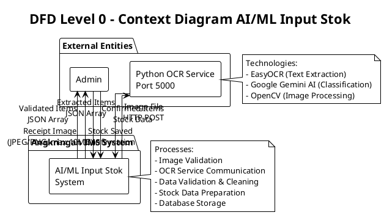
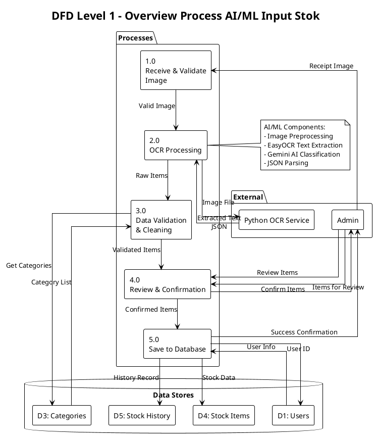
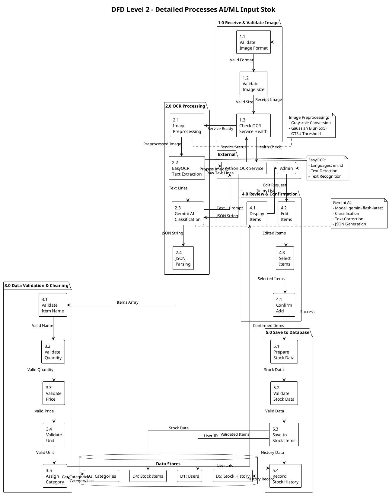
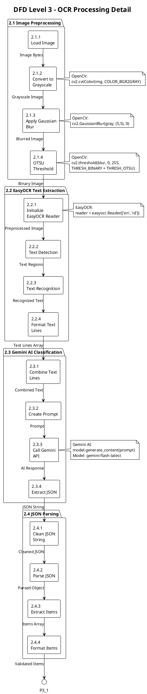
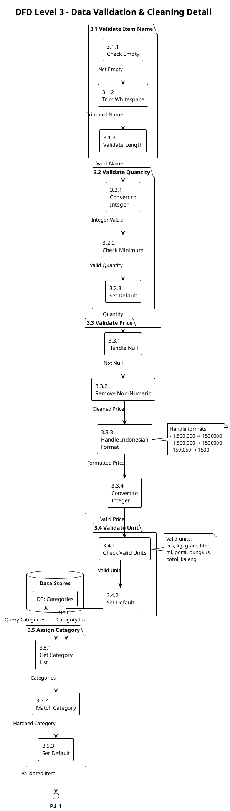
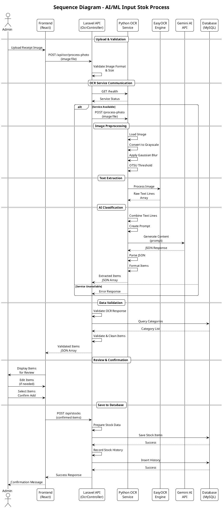
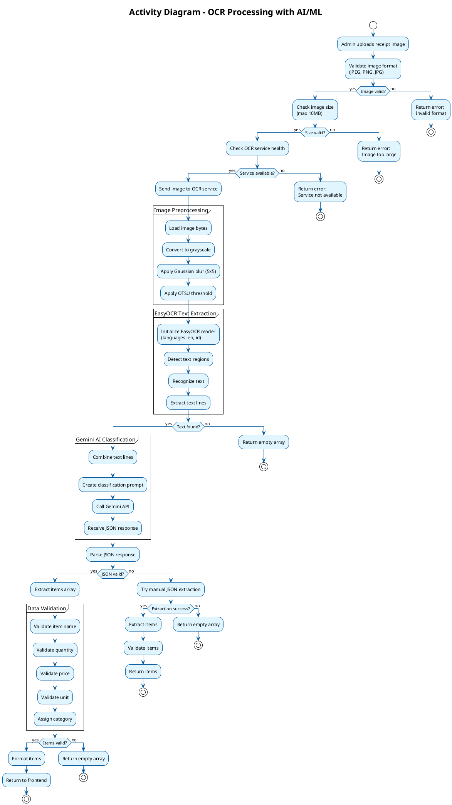
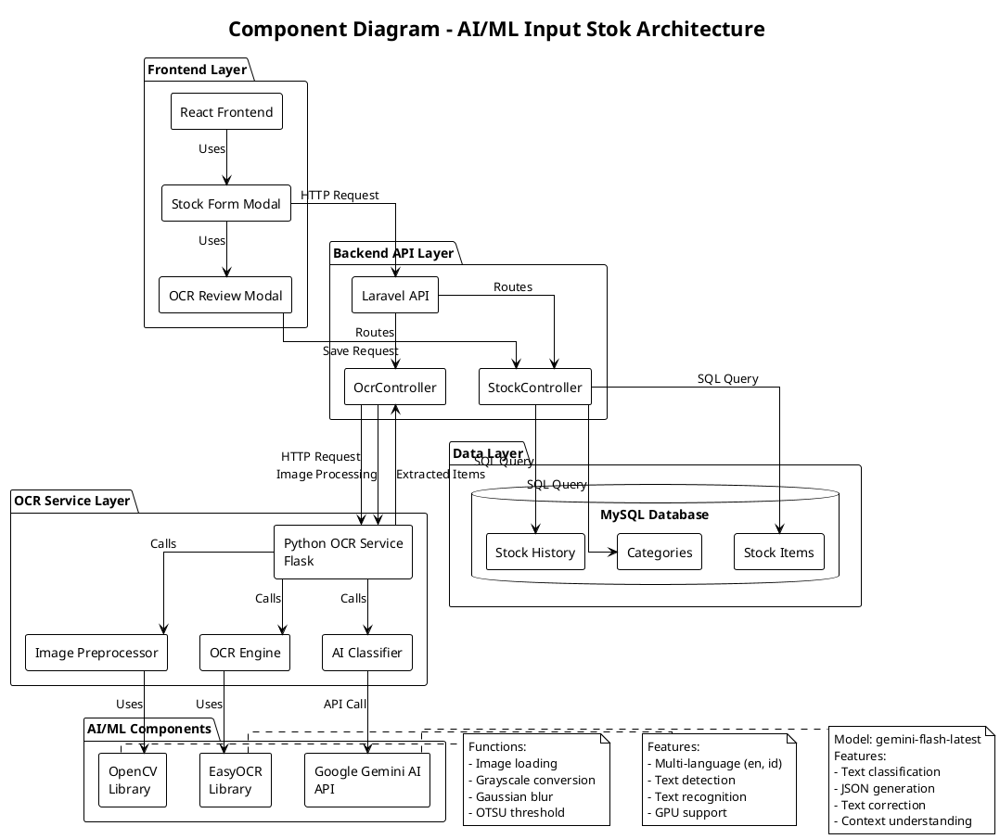

# DFD AI/Machine Learning Input Stok - Angkringan IMS

Dokumentasi ini fokus pada proses AI/ML yang digunakan untuk input stok menggunakan OCR (Optical Character Recognition) dan AI untuk ekstraksi data dari gambar struk belanja.

## Daftar Isi
1. [DFD Level 0 - Context Diagram (AI/ML Input Stok)](#dfd-level-0---context-diagram-aiml-input-stok)
2. [DFD Level 1 - Overview Process](#dfd-level-1---overview-process)
3. [DFD Level 2 - Detailed Processes](#dfd-level-2---detailed-processes)
4. [DFD Level 3 - Sub-Process Details](#dfd-level-3---sub-process-details)
5. [Sequence Diagram - AI/ML Input Stok](#sequence-diagram---aiml-input-stok)
6. [Activity Diagram - OCR Processing](#activity-diagram---ocr-processing)
7. [Component Diagram - AI/ML Architecture](#component-diagram---aiml-architecture)
8. [Data Dictionary - AI/ML Input Stok](#data-dictionary---aiml-input-stok)

---

## DFD Level 0 - Context Diagram (AI/ML Input Stok)

Diagram konteks menunjukkan interaksi antara entitas eksternal dengan sistem untuk proses AI/ML input stok.

### PlantUML Syntax



### Penjelasan

**External Entities:**
- **Admin**: Pengguna yang mengupload gambar struk dan melakukan review hasil OCR
- **Python OCR Service**: Layanan eksternal yang melakukan ekstraksi teks dan klasifikasi menggunakan AI

**Data Flows:**
- **Receipt Image**: Gambar struk belanja dalam format JPEG/PNG (max 10MB)
- **Image File**: File gambar yang dikirim ke OCR service via HTTP POST
- **Extracted Items**: Data item yang diekstrak dalam format JSON array
- **Validated Items**: Data item yang sudah divalidasi dan diformat
- **Confirmed Items**: Data item yang dikonfirmasi admin untuk disimpan
- **Stock Saved**: Konfirmasi bahwa data stok berhasil disimpan

---

## DFD Level 1 - Overview Process

Diagram ini memecah sistem AI/ML input stok menjadi proses-proses utama.

### PlantUML Syntax



### Penjelasan Proses

1. **Receive & Validate Image (1.0)**: Menerima dan memvalidasi gambar struk
2. **OCR Processing (2.0)**: Memproses gambar menggunakan AI/ML untuk ekstraksi data
3. **Data Validation & Cleaning (3.0)**: Memvalidasi dan membersihkan data hasil OCR
4. **Review & Confirmation (4.0)**: Admin mereview dan mengkonfirmasi item yang akan disimpan
5. **Save to Database (5.0)**: Menyimpan data stok ke database

---

## DFD Level 2 - Detailed Processes

Diagram ini memecah setiap proses utama menjadi sub-proses yang lebih detail.

### PlantUML Syntax



---

## DFD Level 3 - Sub-Process Details

Diagram detail untuk sub-proses yang kompleks.

### PlantUML Syntax - OCR Processing Detail



### PlantUML Syntax - Data Validation Detail



---

## Sequence Diagram - AI/ML Input Stok

Diagram sequence menunjukkan interaksi temporal antara komponen dalam proses AI/ML input stok.

### PlantUML Syntax



---

## Activity Diagram - OCR Processing

Diagram aktivitas menunjukkan alur kerja proses OCR dengan AI/ML.

### PlantUML Syntax



---

## Component Diagram - AI/ML Architecture

Diagram komponen menunjukkan arsitektur sistem AI/ML untuk input stok.

### PlantUML Syntax



---

## Data Dictionary - AI/ML Input Stok

### Input Data Flows

#### Receipt Image
- **Type**: Binary File
- **Format**: JPEG, PNG, JPG
- **Max Size**: 10MB
- **Source**: Admin (Frontend Upload)
- **Destination**: Process 1.0 (Receive & Validate Image)
- **Structure**: 
  ```
  Multipart Form Data:
  - image: File
  ```

#### Image File (to OCR Service)
- **Type**: Binary File
- **Format**: JPEG, PNG, JPG
- **Source**: Process 1.0
- **Destination**: Python OCR Service
- **Transport**: HTTP POST
- **Endpoint**: `http://127.0.0.1:5000/process-photo`

### Processing Data Flows

#### Preprocessed Image
- **Type**: Binary Image
- **Format**: Grayscale Binary (OTSU Threshold)
- **Source**: Process 2.1 (Image Preprocessing)
- **Destination**: Process 2.2 (EasyOCR Text Extraction)
- **Properties**:
  - Grayscale: Yes
  - Blur: Gaussian 5x5
  - Threshold: OTSU Binary

#### Raw Text Lines
- **Type**: Array of Strings
- **Source**: Process 2.2 (EasyOCR Text Extraction)
- **Destination**: Process 2.3 (Gemini AI Classification)
- **Example**:
  ```json
  [
    "TOKO MAKMUR",
    "Jl. Raya No. 123",
    "Nasi Putih 5 kg 25000",
    "Ayam 2 ekor 50000",
    "Total: 75000"
  ]
  ```

#### Classification Prompt
- **Type**: String
- **Source**: Process 2.3 (Gemini AI Classification)
- **Destination**: Google Gemini API
- **Structure**:
  ```
  berikut teks hasil OCR dari struk belanja:
  [combined text lines]
  
  tolong ektrak jadi JSON dengan format:
  [
    {
      "nama_barang": "...", 
      "jumlah": "...", 
      "harga": "..."
    }
  ]
  
  [additional instructions]
  ```

#### JSON Response (from Gemini)
- **Type**: String (JSON)
- **Source**: Google Gemini API
- **Destination**: Process 2.4 (JSON Parsing)
- **Example**:
  ```json
  [
    {
      "nama_barang": "Nasi Putih",
      "jumlah": "5",
      "harga": "25000"
    },
    {
      "nama_barang": "Ayam",
      "jumlah": "2",
      "harga": "50000"
    }
  ]
  ```

### Output Data Flows

#### Extracted Items (Raw)
- **Type**: Array of Objects
- **Source**: Process 2.4 (JSON Parsing)
- **Destination**: Process 3.0 (Data Validation)
- **Structure**:
  ```json
  [
    {
      "nama_barang": "Nasi Putih",
      "jumlah": "5",
      "harga": "25000",
      "unit": "pcs",
      "category_id": 1,
      "minStock": 10
    }
  ]
  ```

#### Validated Items
- **Type**: Array of Objects
- **Source**: Process 3.0 (Data Validation & Cleaning)
- **Destination**: Process 4.0 (Review & Confirmation)
- **Structure**:
  ```json
  [
    {
      "nama_barang": "Nasi Putih",
      "jumlah": 5,
      "harga": 25000,
      "unit": "kg",
      "category_id": 1,
      "minStock": 10
    }
  ]
  ```

#### Confirmed Items
- **Type**: Array of Objects
- **Source**: Process 4.0 (Review & Confirmation)
- **Destination**: Process 5.0 (Save to Database)
- **Structure**:
  ```json
  [
    {
      "name": "Nasi Putih",
      "category_id": 1,
      "buyPrice": 25000,
      "quantity": 5,
      "unit": "kg",
      "minStock": 10,
      "is_divisible": false,
      "max_divisions": "",
      "division_description": ""
    }
  ]
  ```

#### Stock Data (for Database)
- **Type**: Object
- **Source**: Process 5.1 (Prepare Stock Data)
- **Destination**: D4 (Stock Items)
- **Structure**:
  ```sql
  {
    nama_bahan: "Nasi Putih",
    id_kategori: 1,
    harga_beli: 25000,
    stok_bahan: 5,
    satuan: "kg",
    min_stok: 10,
    is_divisible: 0,
    max_divisions: null,
    division_description: null,
    updated_by: [user_id]
  }
  ```

### Error Data Flows

#### Error Response
- **Type**: JSON Object
- **Source**: Any Process
- **Destination**: Admin (Frontend)
- **Structure**:
  ```json
  {
    "success": false,
    "error": "Error type",
    "message": "Error message description"
  }
  ```

**Error Types:**
1. **Service Not Available**: OCR service tidak berjalan
2. **Processing Timeout**: Proses OCR > 60 detik
3. **Invalid Image Format**: Format gambar tidak didukung
4. **Image Too Large**: Ukuran > 10MB
5. **OCR Failed**: Gagal ekstraksi teks
6. **Invalid Response**: Response dari OCR service tidak valid
7. **No Valid Items**: Tidak ada item valid yang ditemukan

---

## Teknologi Stack

### Frontend
- **Framework**: React 19
- **HTTP Client**: Axios
- **UI Components**: Custom React Components

### Backend API
- **Framework**: Laravel 10
- **Language**: PHP 8.2+
- **HTTP Client**: Guzzle HTTP

### OCR Service
- **Framework**: Flask (Python)
- **Language**: Python 3.8+
- **OCR Engine**: EasyOCR
- **AI Model**: Google Gemini Flash
- **Image Processing**: OpenCV
- **Port**: 5000

### Database
- **DBMS**: MySQL
- **ORM**: Eloquent (Laravel)

---

## API Endpoints

### POST /api/ocr/process-photo
- **Purpose**: Memproses gambar struk menggunakan OCR dan AI
- **Input**: Multipart form data dengan field `image`
- **Output**: JSON dengan extracted items
- **Timeout**: 60 detik
- **Error Codes**:
  - 400: Invalid image format
  - 503: OCR service not available
  - 504: Processing timeout
  - 500: Internal server error

### GET /api/ocr/health
- **Purpose**: Check status OCR service
- **Output**: Service health information
- **Timeout**: 5 detik

### POST /api/stocks
- **Purpose**: Menyimpan data stok ke database
- **Input**: JSON array of stock items
- **Output**: Success confirmation
- **Authentication**: Required (Sanctum)

---

## Cara Menggunakan PlantUML

1. **Online Editor**: 
   - Kunjungi http://www.plantuml.com/plantuml/uml/
   - Copy-paste syntax PlantUML
   - Generate diagram

2. **VS Code Extension**:
   - Install extension "PlantUML"
   - Create file dengan ekstensi `.puml`
   - Preview dengan `Alt+D`

3. **Command Line**:
   ```bash
   java -jar plantuml.jar diagram.puml
   ```

4. **IntelliJ IDEA**:
   - Install plugin "PlantUML integration"
   - Create file `.puml`
   - Preview diagram

---

## Revisi History

- **Version 1.0** (2025-01-XX): Initial documentation
  - DFD Level 0-3 untuk AI/ML Input Stok
  - Sequence Diagram
  - Activity Diagram
  - Component Diagram
  - Data Dictionary
  - PlantUML syntax untuk semua diagram

