# DFD (Data Flow Diagram) - Angkringan IMS

## Daftar Isi

1. [DFD Level 0 (Context Diagram)](#dfd-level-0-context-diagram)
2. [DFD Level 1 (Overview Diagram)](#dfd-level-1-overview-diagram)
3. [DFD Level 2 (Detailed Processes)](#dfd-level-2-detailed-processes)
4. [DFD Level 3 (Sub-Process Details)](#dfd-level-3-sub-process-details)
5. [Keterangan Simbol DFD](#keterangan-simbol-dfd)
6. [Data Dictionary](#data-dictionary)

---

## DFD Level 0 (Context Diagram)

DFD Level 0 menunjukkan sistem secara keseluruhan dan interaksinya dengan entitas eksternal.

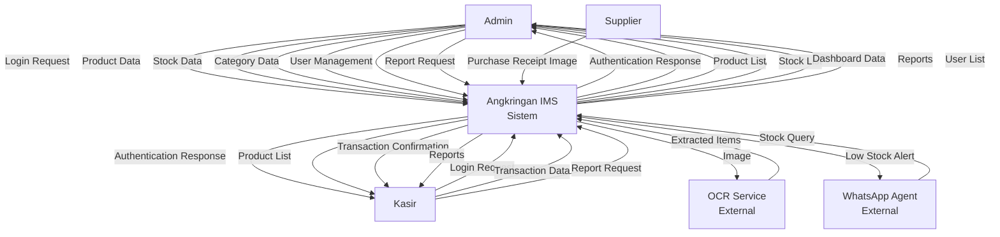

### Penjelasan DFD Level 0

**External Entities:**

-   **Admin**: Pengguna dengan akses penuh untuk mengelola produk, stok, kategori, dan laporan
-   **Kasir**: Pengguna dengan akses terbatas untuk melakukan transaksi dan melihat laporan
-   **Supplier**: Pemasok yang menyediakan struk belanja untuk diproses
-   **OCR Service**: Layanan eksternal untuk ekstraksi teks dari gambar struk
-   **WhatsApp Agent**: Layanan eksternal untuk mengirim notifikasi via WhatsApp

**Data Flows:**

-   Login Request: Kredensial pengguna (email, password)
-   Product Data: Data produk (nama, harga, kategori, dll)
-   Stock Data: Data stok (nama, jumlah, harga beli, dll)
-   Transaction Data: Data transaksi penjualan
-   Report Request: Permintaan laporan (penjualan, inventori)
-   Purchase Receipt Image: Gambar struk belanja dari supplier
-   Extracted Items: Data item yang diekstrak dari struk
-   Low Stock Alert: Notifikasi stok menipis

---

## DFD Level 1 (Overview Diagram)

DFD Level 1 memecah sistem menjadi proses-proses utama.

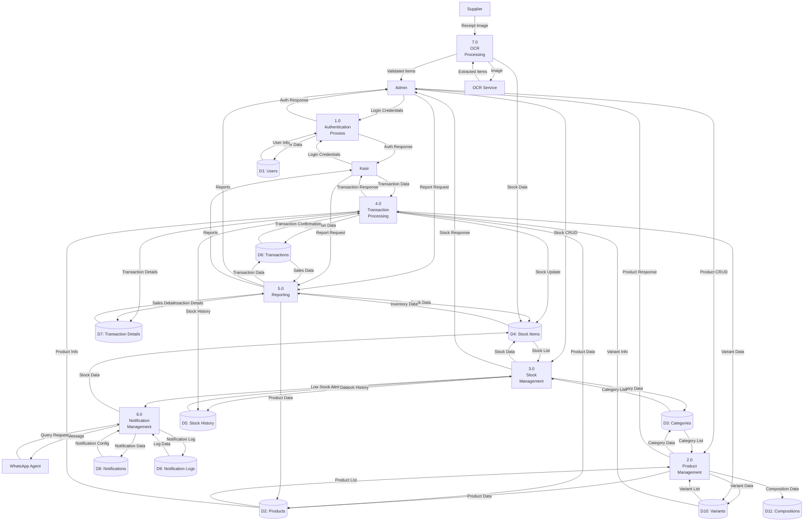

### Penjelasan DFD Level 1

**Processes:**

1. **Authentication Process (1.0)**: Menangani login, logout, dan validasi pengguna
2. **Product Management (2.0)**: Mengelola produk, kategori, varian, dan komposisi
3. **Stock Management (3.0)**: Mengelola stok bahan baku, riwayat stok, dan update stok
4. **Transaction Processing (4.0)**: Memproses transaksi penjualan dan update stok otomatis
5. **Reporting (5.0)**: Menghasilkan laporan penjualan dan inventori
6. **Notification Management (6.0)**: Mengelola notifikasi stok menipis dan pengiriman alert
7. **OCR Processing (7.0)**: Memproses gambar struk dan ekstraksi data item

**Data Stores:**

-   **D1: Users**: Data pengguna (admin, kasir)
-   **D2: Products**: Data produk jadi
-   **D3: Categories**: Data kategori produk dan stok
-   **D4: Stock Items**: Data bahan baku dan stok
-   **D5: Stock History**: Riwayat perubahan stok
-   **D6: Transactions**: Data transaksi penjualan
-   **D7: Transaction Details**: Detail item dalam transaksi
-   **D8: Notifications**: Konfigurasi notifikasi
-   **D9: Notification Logs**: Log notifikasi yang dikirim
-   **D10: Variants**: Data varian produk
-   **D11: Compositions**: Data komposisi bahan baku produk

---

## DFD Level 2 (Detailed Processes)

DFD Level 2 memecah setiap proses utama menjadi sub-proses yang lebih detail.

### 2.0 Product Management - Decomposed

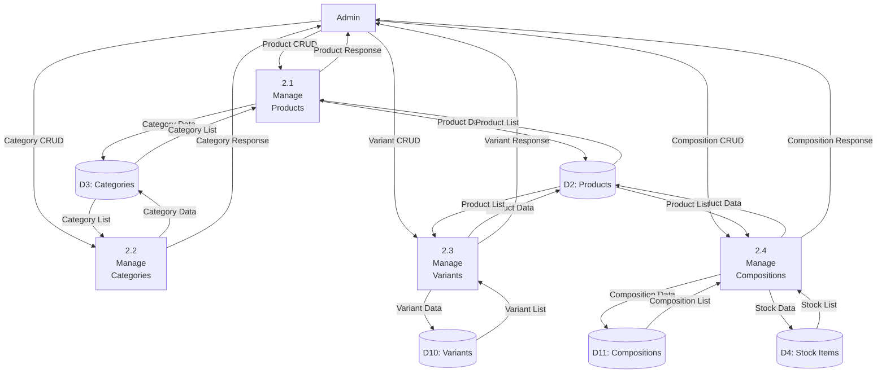

### 3.0 Stock Management - Decomposed

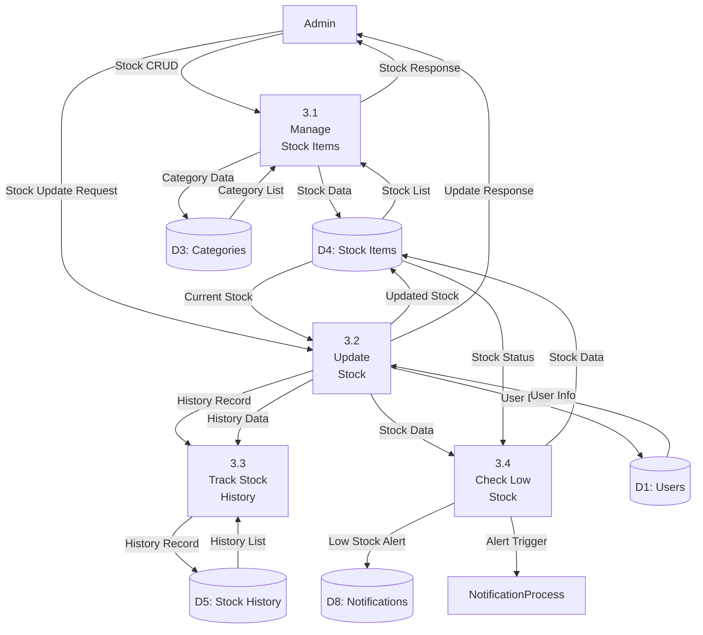

### 4.0 Transaction Processing - Decomposed

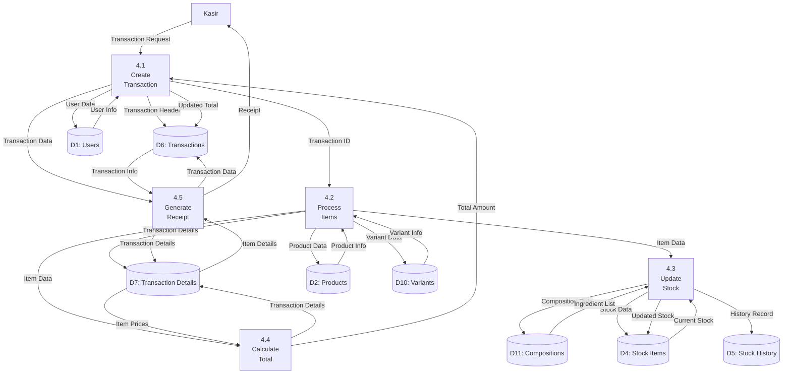

### 5.0 Reporting - Decomposed

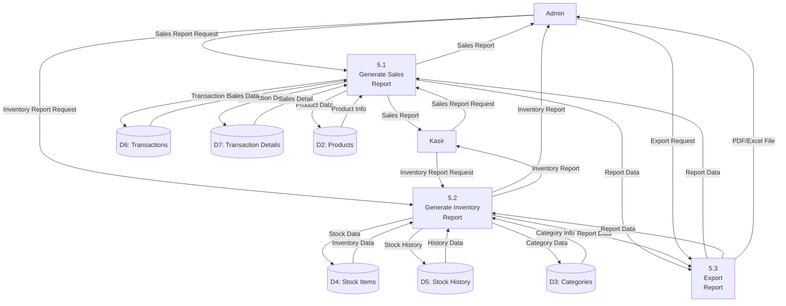

### 6.0 Notification Management - Decomposed

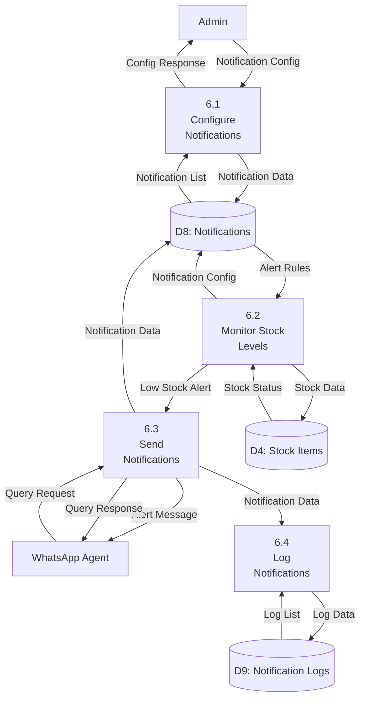

### 7.0 OCR Processing - Decomposed

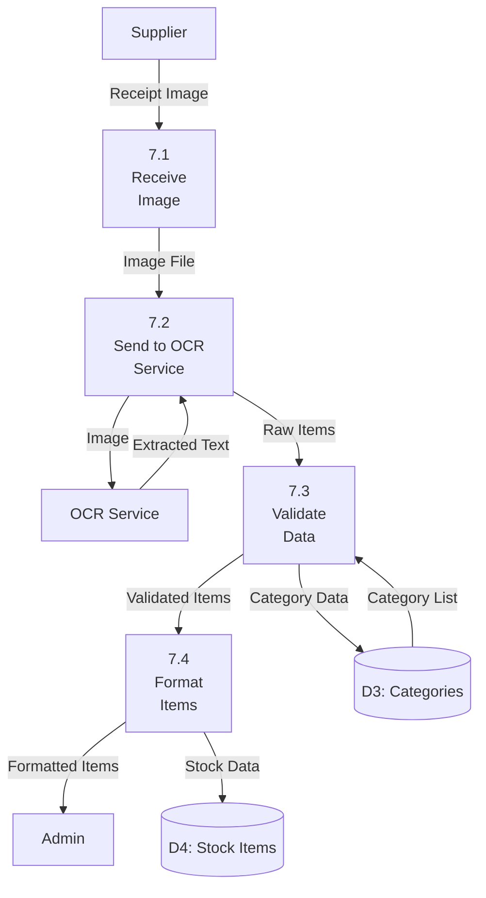

---

## DFD Level 3 (Sub-Process Details)

DFD Level 3 menunjukkan detail lebih lanjut dari sub-proses yang kompleks.

### 4.2 Process Items - Decomposed

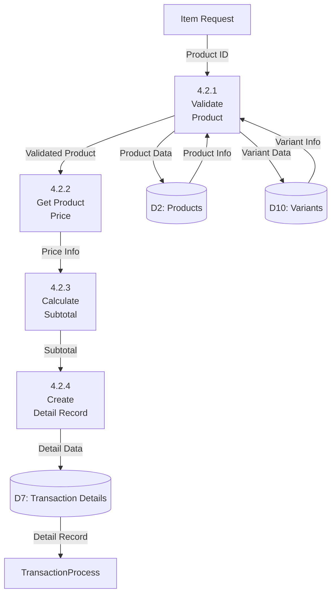

### 4.3 Update Stock - Decomposed

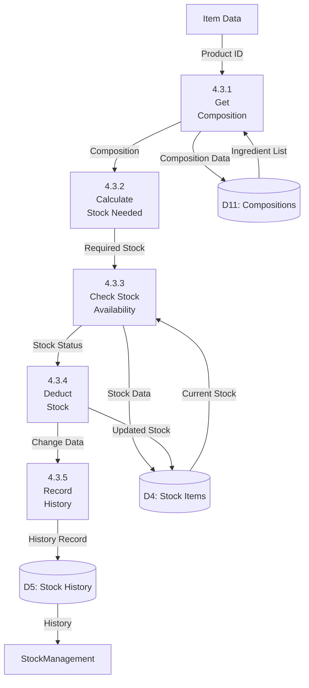

### 7.3 Validate Data - Decomposed

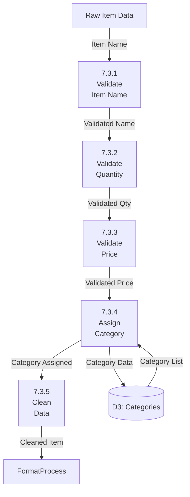

---

## AI/ML Input Stok - Proses Detail

Bagian ini menjelaskan secara detail proses AI/ML yang digunakan untuk input stok menggunakan OCR (Optical Character Recognition) dan AI untuk ekstraksi data dari gambar struk belanja.

### Alur Lengkap AI/ML Input Stok

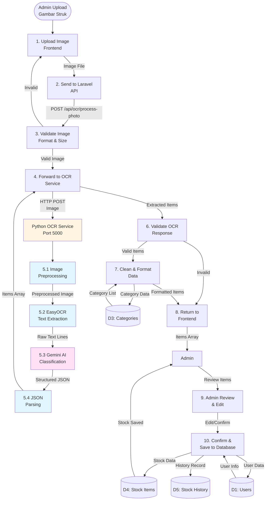

### Teknologi AI/ML yang Digunakan

#### 1. EasyOCR (Optical Character Recognition)

-   **Fungsi**: Ekstraksi teks dari gambar struk
-   **Bahasa**: English (en) dan Indonesian (id)
-   **Proses**:
    -   Image preprocessing (grayscale, blur, threshold)
    -   Text detection dan recognition
    -   Output: Array of text lines

#### 2. Google Gemini AI (Generative AI)

-   **Model**: gemini-flash-latest
-   **Fungsi**: Klasifikasi dan strukturisasi teks hasil OCR
-   **Proses**:
    -   Menerima teks mentah dari EasyOCR
    -   Mengklasifikasi menjadi nama_barang, jumlah, harga
    -   Mengoreksi penulisan nama barang
    -   Output: JSON terstruktur

### Detail Proses AI/ML

#### 5.1 Image Preprocessing

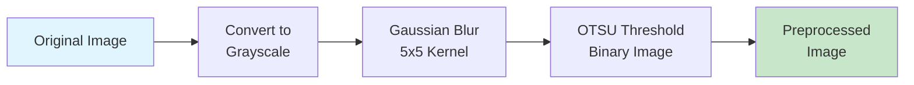

**Fungsi:**

-   Meningkatkan kualitas gambar untuk OCR
-   Mengurangi noise
-   Meningkatkan kontras teks

#### 5.2 EasyOCR Text Extraction

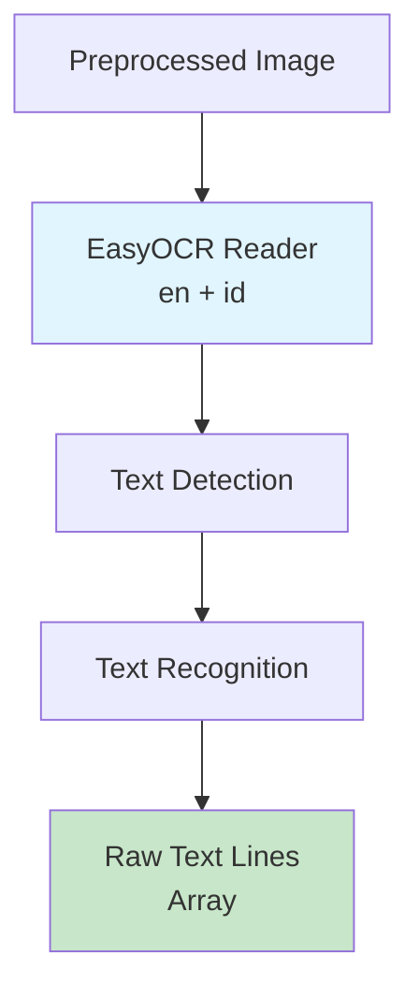

**Output Contoh:**

```
[
  "TOKO MAKMUR",
  "Jl. Raya No. 123",
  "Nasi Putih 5 kg 25000",
  "Ayam 2 ekor 50000",
  "Total: 75000"
]
```

#### 5.3 Gemini AI Classification

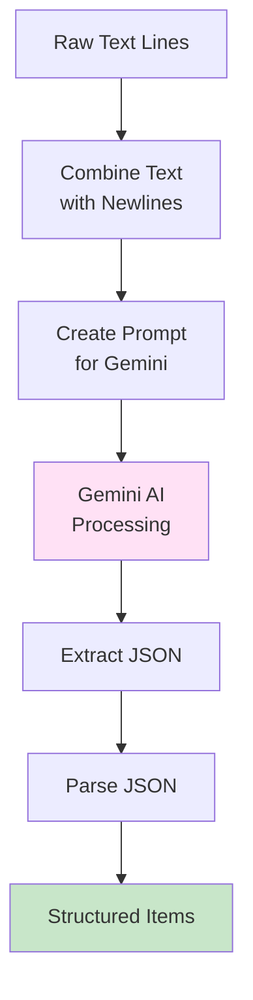

**Prompt yang Dikirim:**

```
berikut teks hasil OCR dari struk belanja:
[teks dari EasyOCR]

tolong ektrak jadi JSON dengan format:
[
  {
    "nama_barang": "...",
    "jumlah": "...",
    "harga": "..."
  }
]

jika ada data yang tidak jelas, isi null.
dan jika ada kata yang bukan nama barang, jumlah, atau harga, abaikan saja.
cukup kembalikan JSON tanpa penjelasan apapun.
dan juga untuk nama barang nya di koreksi lagi penulisannya jika ada yang salah.
```

**Output Gemini AI:**

```json
[
    {
        "nama_barang": "Nasi Putih",
        "jumlah": "5",
        "harga": "25000"
    },
    {
        "nama_barang": "Ayam",
        "jumlah": "2",
        "harga": "50000"
    }
]
```

#### 5.4 Data Validation & Cleaning

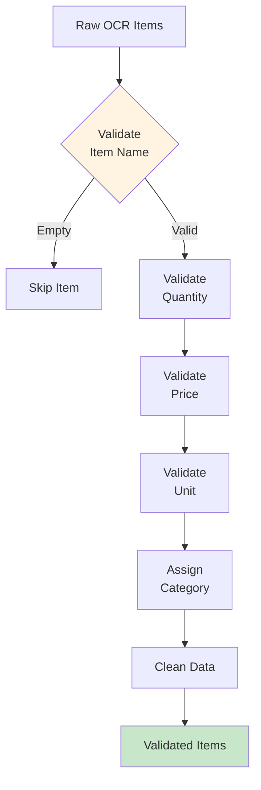

**Validasi yang Dilakukan:**

1. **Nama Barang**: Tidak boleh kosong
2. **Jumlah**: Minimum 1, convert ke integer
3. **Harga**:
    - Handle null/empty → 0
    - Remove non-numeric characters
    - Handle format Indonesia (1.500.000 → 1500000)
    - Convert ke integer
4. **Unit**: Validasi dari list (pcs, kg, gram, liter, ml, porsi, bungkus, botol, kaleng)
5. **Category ID**: Minimum 1, default 1
6. **Min Stock**: Minimum 0, default 10

### DFD Level 3 - OCR Processing Detail

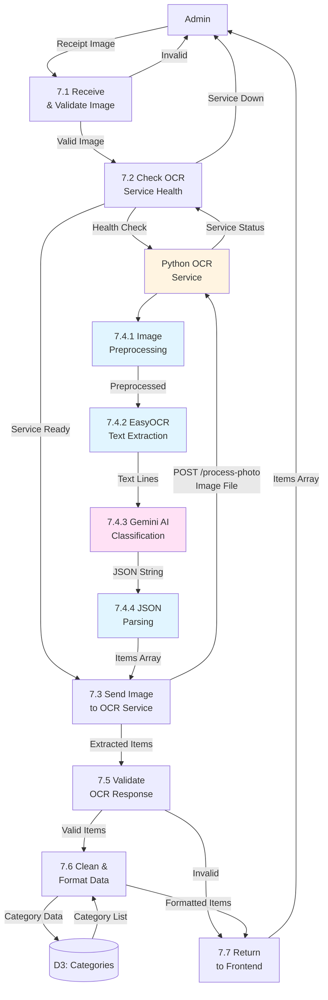

### Proses Review & Save ke Database

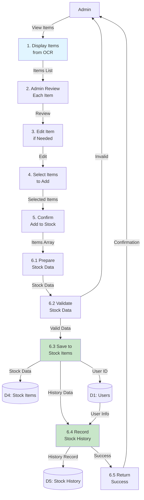

### Data Flow - AI/ML Input Stok

#### Input: Receipt Image

-   **Format**: JPEG, PNG, JPG
-   **Max Size**: 10MB
-   **Source**: Admin upload via frontend
-   **Destination**: Process 7.1 (Receive Image)

#### Output: Extracted Items

-   **Format**: JSON Array
-   **Structure**:
    ```json
    [
        {
            "nama_barang": "Nasi Putih",
            "jumlah": "5",
            "harga": 25000,
            "unit": "kg",
            "category_id": 1,
            "minStock": 10
        }
    ]
    ```
-   **Source**: Process 7.6 (Return to Frontend)
-   **Destination**: Admin (Frontend)

#### Stock Data untuk Database

-   **Format**: Object
-   **Structure**:
    ```json
    {
        "name": "Nasi Putih",
        "category_id": 1,
        "buyPrice": 25000,
        "quantity": 5,
        "unit": "kg",
        "minStock": 10,
        "is_divisible": false,
        "max_divisions": "",
        "division_description": ""
    }
    ```
-   **Source**: Process 6.3 (Save to Stock Items)
-   **Destination**: D4 (Stock Items)

### Error Handling

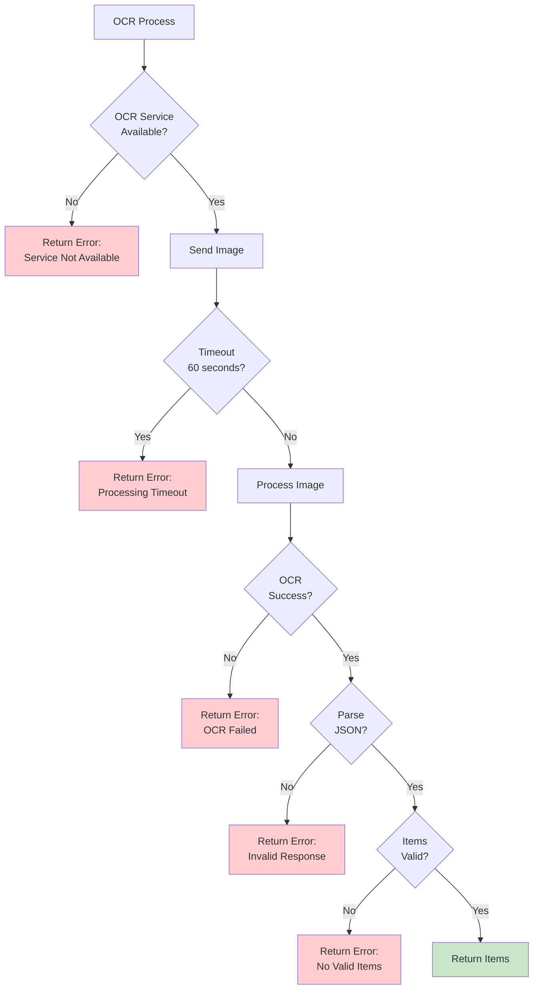

### Keuntungan AI/ML Input Stok

1. **Efisiensi**: Mengurangi waktu input manual dari menit menjadi detik
2. **Akurasi**: AI membantu mengoreksi penulisan nama barang
3. **Otomatisasi**: Ekstraksi data otomatis dari struk
4. **User Experience**: Admin hanya perlu review dan konfirmasi
5. **Scalability**: Dapat memproses banyak item sekaligus

### Teknologi Stack

-   **Backend API**: Laravel 10 (PHP)
-   **OCR Engine**: EasyOCR (Python)
-   **AI Model**: Google Gemini Flash (Python)
-   **Frontend**: React 19 (JavaScript)
-   **Communication**: HTTP REST API
-   **Image Processing**: OpenCV (Python)

### API Endpoints

#### POST /api/ocr/process-photo

-   **Input**: Multipart form data dengan field `image`
-   **Output**: JSON dengan struktur:
    ```json
    {
      "success": true,
      "data": {
        "items": [...],
        "count": 5
      }
    }
    ```
-   **Timeout**: 60 detik
-   **Error Handling**: Comprehensive dengan pesan error yang jelas

#### GET /api/ocr/health

-   **Purpose**: Check OCR service status
-   **Output**: Service health information

---

## Keterangan Simbol DFD

### 1. External Entity (Entitas Eksternal)

-   **Simbol**: Kotak dengan nama entitas
-   **Contoh**: Admin, Kasir, Supplier, OCR Service
-   **Fungsi**: Entitas di luar sistem yang berinteraksi dengan sistem

### 2. Process (Proses)

-   **Simbol**: Lingkaran atau kotak dengan sudut membulat
-   **Format**: Nomor.0 untuk level 1, Nomor.Sub untuk level 2, dll
-   **Fungsi**: Transformasi data atau aktivitas bisnis

### 3. Data Store (Penyimpanan Data)

-   **Simbol**: Dua garis horizontal dengan nama data store
-   **Format**: D1, D2, D3, dll
-   **Fungsi**: Tempat penyimpanan data persisten

### 4. Data Flow (Alur Data)

-   **Simbol**: Panah dengan label nama data
-   **Fungsi**: Alur data antara proses, entitas, dan data store
-   **Aturan**:
    -   Harus memiliki label yang jelas
    -   Tidak boleh langsung dari data store ke data store
    -   Tidak boleh langsung dari external entity ke external entity

### 5. Data Dictionary

Setiap data flow harus memiliki definisi yang jelas dalam data dictionary.

---

## Data Dictionary

### Data Flows

#### Login Credentials

-   **Type**: Data
-   **Structure**:
    -   email: string
    -   password: string
-   **Source**: Admin, Kasir
-   **Destination**: Process 1.0 (Authentication)

#### User Data

-   **Type**: Data
-   **Structure**:
    -   id: integer
    -   name: string
    -   email: string
    -   role: enum (admin, kasir)
    -   status: enum (active, inactive)
-   **Source**: D1 (Users)
-   **Destination**: Process 1.0 (Authentication)

#### Product Data

-   **Type**: Data
-   **Structure**:
    -   id: integer
    -   name: string
    -   category_id: integer
    -   sell_price: decimal
    -   description: text
-   **Source**: D2 (Products)
-   **Destination**: Process 2.0, 4.0

#### Stock Data

-   **Type**: Data
-   **Structure**:
    -   id: integer
    -   name: string
    -   category_id: integer
    -   buy_price: decimal
    -   quantity: decimal
    -   unit: string
    -   min_stock_limit: decimal
-   **Source**: D4 (Stock Items)
-   **Destination**: Process 3.0, 4.0, 5.0

#### Transaction Data

-   **Type**: Data
-   **Structure**:
    -   id: integer
    -   transaction_date: timestamp
    -   total_amount: decimal
    -   payment_method: enum
    -   customer_name: string
    -   created_by: integer
-   **Source**: D6 (Transactions)
-   **Destination**: Process 4.0, 5.0

#### Transaction Details

-   **Type**: Data
-   **Structure**:
    -   id: integer
    -   transaction_id: integer
    -   product_id: integer
    -   variant_id: integer
    -   quantity: decimal
    -   unit_price: decimal
    -   total_price: decimal
-   **Source**: D7 (Transaction Details)
-   **Destination**: Process 4.0, 5.0

#### Stock History

-   **Type**: Data
-   **Structure**:
    -   id: integer
    -   stock_item_id: integer
    -   change_type: enum (in, out, adjustment)
    -   quantity_before: decimal
    -   quantity_after: decimal
    -   quantity_change: decimal
    -   reason: string
    -   created_by: integer
-   **Source**: D5 (Stock History)
-   **Destination**: Process 3.0, 5.0

#### Extracted Items

-   **Type**: Data
-   **Structure**:
    -   nama_barang: string
    -   jumlah: string
    -   harga: integer
    -   unit: string
    -   category_id: integer
-   **Source**: OCR Service
-   **Destination**: Process 7.0

#### Low Stock Alert

-   **Type**: Data
-   **Structure**:
    -   stock_item_id: integer
    -   item_name: string
    -   current_stock: decimal
    -   min_stock_limit: decimal
    -   message: string
-   **Source**: Process 6.0
-   **Destination**: WhatsApp Agent

### Data Stores

#### D1: Users

-   **Description**: Menyimpan data pengguna sistem (admin dan kasir)
-   **Key Fields**: id, email, password, role
-   **Volume**: ~10-50 records
-   **Access**: Read/Write oleh Process 1.0

#### D2: Products

-   **Description**: Menyimpan data produk jadi yang dijual
-   **Key Fields**: id, name, category_id, sell_price
-   **Volume**: ~50-200 records
-   **Access**: Read/Write oleh Process 2.0, 4.0, 5.0

#### D3: Categories

-   **Description**: Menyimpan data kategori produk dan stok
-   **Key Fields**: id, name, description
-   **Volume**: ~10-30 records
-   **Access**: Read/Write oleh Process 2.0, 3.0, 7.0

#### D4: Stock Items

-   **Description**: Menyimpan data bahan baku dan stok
-   **Key Fields**: id, name, category_id, quantity, buy_price
-   **Volume**: ~50-200 records
-   **Access**: Read/Write oleh Process 3.0, 4.0, 5.0, 6.0, 7.0

#### D5: Stock History

-   **Description**: Menyimpan riwayat perubahan stok
-   **Key Fields**: id, stock_item_id, change_type, quantity_change
-   **Volume**: ~1000-10000 records (growing)
-   **Access**: Write oleh Process 3.0, 4.0; Read oleh Process 5.0

#### D6: Transactions

-   **Description**: Menyimpan data transaksi penjualan
-   **Key Fields**: id, transaction_date, total_amount, payment_method
-   **Volume**: ~1000-50000 records (growing)
-   **Access**: Write oleh Process 4.0; Read oleh Process 5.0

#### D7: Transaction Details

-   **Description**: Menyimpan detail item dalam transaksi
-   **Key Fields**: id, transaction_id, product_id, quantity, unit_price
-   **Volume**: ~5000-250000 records (growing)
-   **Access**: Write oleh Process 4.0; Read oleh Process 5.0

#### D8: Notifications

-   **Description**: Menyimpan konfigurasi notifikasi stok
-   **Key Fields**: id, stock_item_id, min_stock_limit, notification_schedule
-   **Volume**: ~50-200 records
-   **Access**: Read/Write oleh Process 6.0

#### D9: Notification Logs

-   **Description**: Menyimpan log notifikasi yang dikirim
-   **Key Fields**: id, notification_id, sent_at, status, message
-   **Volume**: ~500-5000 records (growing)
-   **Access**: Write oleh Process 6.0; Read oleh Process 6.0

#### D10: Variants

-   **Description**: Menyimpan data varian produk (ukuran, porsi)
-   **Key Fields**: id, product_id, name, price
-   **Volume**: ~100-500 records
-   **Access**: Read/Write oleh Process 2.0, 4.0

#### D11: Compositions

-   **Description**: Menyimpan komposisi bahan baku untuk setiap produk
-   **Key Fields**: id, product_id, stock_item_id, quantity
-   **Volume**: ~200-1000 records
-   **Access**: Read/Write oleh Process 2.0, 4.0

---

## Catatan Penting

1. **Konsistensi Data**: Semua proses harus memastikan konsistensi data antara data stores
2. **Validasi**: Setiap input dari external entity harus divalidasi sebelum diproses
3. **Error Handling**: Setiap proses harus memiliki mekanisme penanganan error
4. **Security**: Proses authentication harus memverifikasi setiap request
5. **Audit Trail**: Semua perubahan data harus tercatat dalam history/log
6. **Performance**: Data store dengan volume besar (D5, D6, D7) perlu optimasi query
7. **Integration**: Proses OCR dan WhatsApp Agent harus memiliki fallback mechanism

---

## Tools untuk Membuat DFD Visual

1. **Mermaid Live Editor**: https://mermaid.live/ (untuk diagram di atas)
2. **Draw.io**: https://app.diagrams.net/ (untuk DFD tradisional)
3. **Lucidchart**: https://www.lucidchart.com/
4. **Visual Paradigm**: https://www.visual-paradigm.com/
5. **Microsoft Visio**: Untuk DFD standar

---

## Revisi History

-   **Version 1.0** (2025-01-XX): Initial DFD documentation
    -   DFD Level 0 (Context Diagram)
    -   DFD Level 1 (Overview Diagram)
    -   DFD Level 2 (Detailed Processes)
    -   DFD Level 3 (Sub-Process Details)
    -   Data Dictionary
