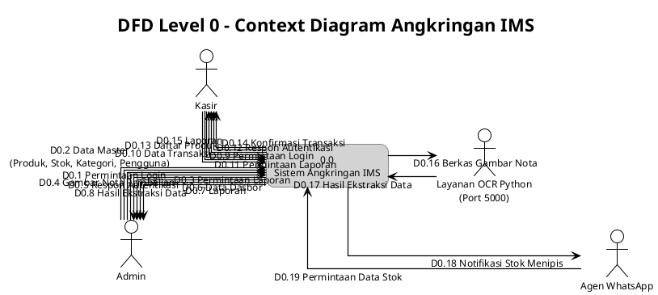
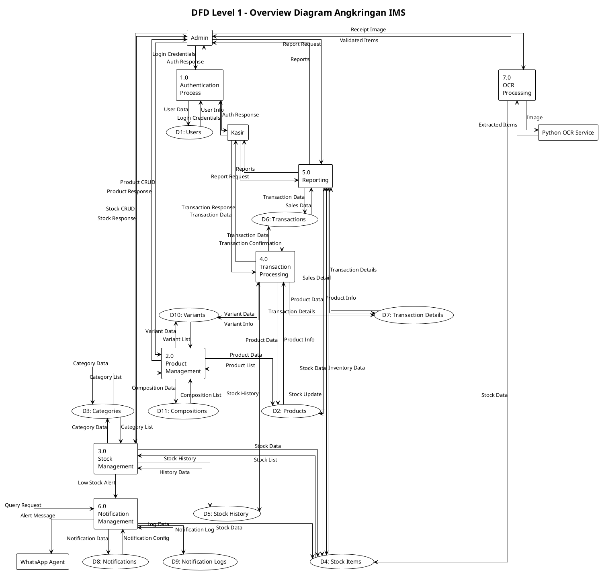
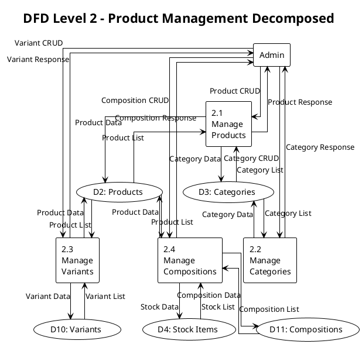
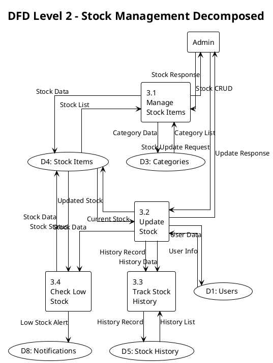
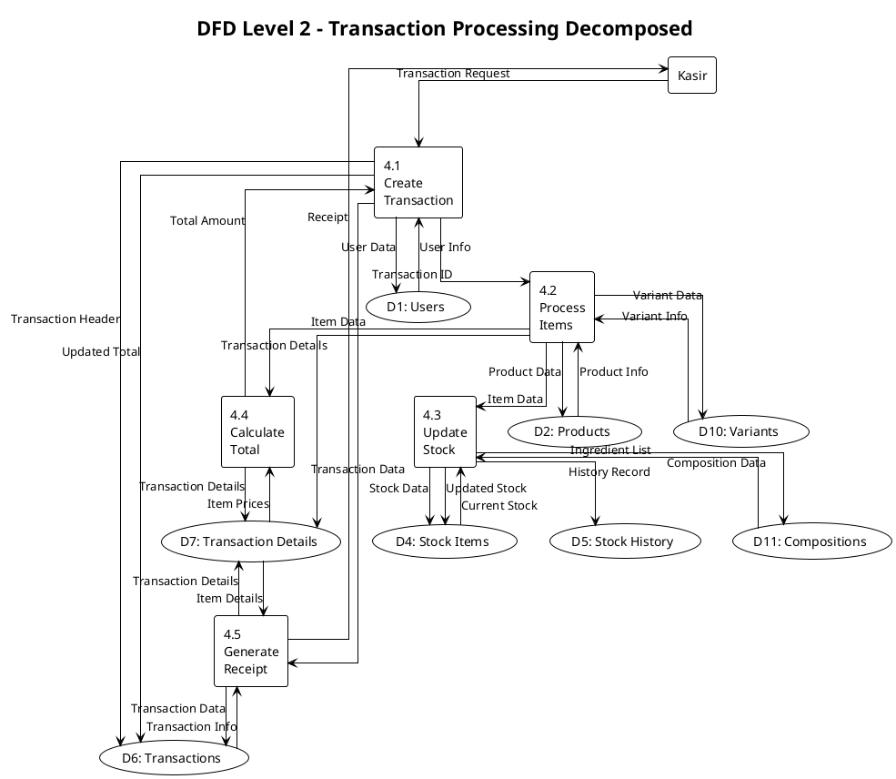
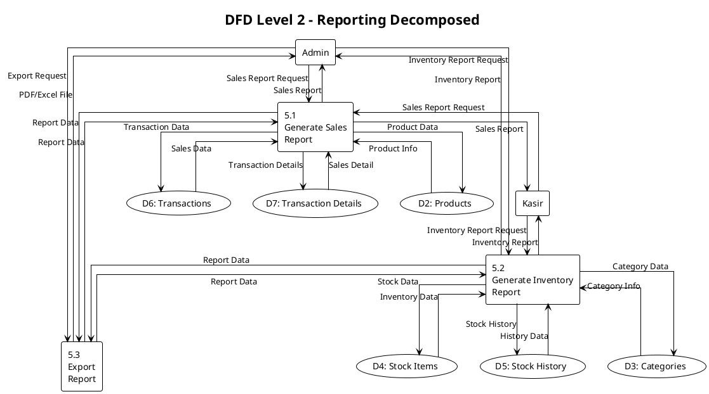
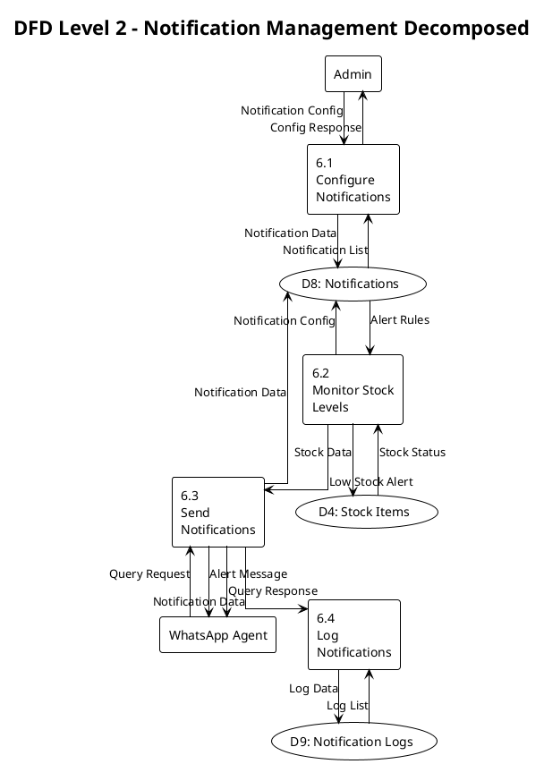
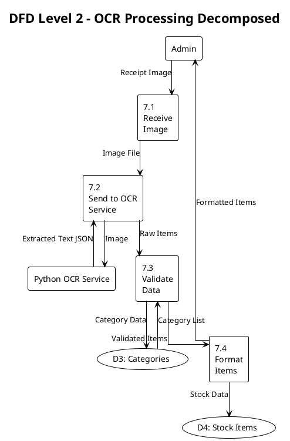

# DFD PlantUML Syntax - Angkringan IMS

File ini berisi syntax PlantUML untuk membuat DFD Level 0, 1, dan 2 untuk sistem Angkringan IMS.

## Cara Menggunakan

1. Copy syntax PlantUML dari bagian yang diinginkan
2. Paste ke http://www.plantuml.com/plantuml/uml/ atau http://www.planttext.com/
3. Atau gunakan VS Code dengan extension PlantUML
4. Generate diagram PNG/SVG

---

## DFD Level 0 - Context Diagram

---

## DFD Level 1 - Overview Diagram

---

## DFD Level 2 - Detailed Processes

### 2.0 Product Management - Decomposed

### 3.0 Stock Management - Decomposed

### 4.0 Transaction Processing - Decomposed

### 5.0 Reporting - Decomposed

### 6.0 Notification Management - Decomposed

### 7.0 OCR Processing - Decomposed

---

## Catatan Penting

1. **Simbol DFD**:

    - External Entity: `[Name]` (kotak)
    - Process: `[Number\nName]` (kotak dengan nomor)
    - Data Store: `(D#: Name)` (database symbol)
    - Data Flow: `-->` dengan label

2. **Penomoran Proses**:

    - Level 1: 1.0, 2.0, 3.0, dst
    - Level 2: 2.1, 2.2, 2.3, dst (decomposed dari 2.0)

3. **Data Stores**:

    - D1: Users
    - D2: Products
    - D3: Categories
    - D4: Stock Items
    - D5: Stock History
    - D6: Transactions
    - D7: Transaction Details
    - D8: Notifications
    - D9: Notification Logs
    - D10: Variants
    - D11: Compositions

4. **External Entities**:
    - Admin
    - Kasir
    - Python OCR Service
    - WhatsApp Agent

---

## Tools untuk Render PlantUML

1. **Online**: http://www.plantuml.com/plantuml/uml/ atau http://www.planttext.com/
2. **VS Code**: Extension "PlantUML"
3. **IntelliJ IDEA**: Plugin "PlantUML integration"
4. **Command Line**: `java -jar plantuml.jar diagram.puml`

---

## Revisi History

-   **Version 2.0** (2025-01-XX): Fixed syntax to use proper PlantUML format
    -   DFD Level 0 (Context Diagram)
    -   DFD Level 1 (Overview Diagram)
    -   DFD Level 2 (Detailed Processes)
        -   Product Management
        -   Stock Management
        -   Transaction Processing
        -   Reporting
        -   Notification Management
        -   OCR Processing
