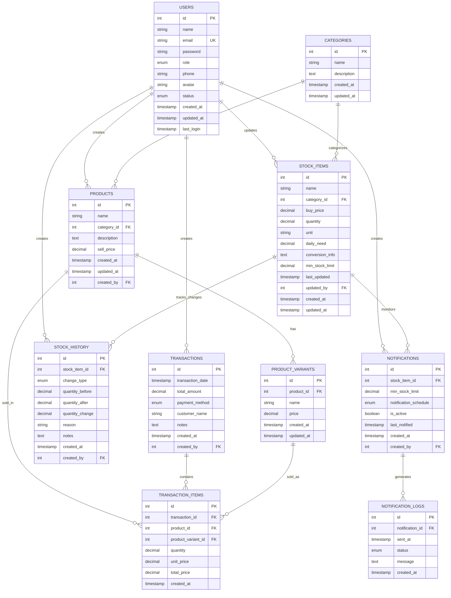

# ERD (Entity Relationship Diagram) - Angkringan IMS

## Mermaid Diagram

## Penjelasan Relasi

### 1. **USERS (Pusat dari semua aktivitas)**

-   **One-to-Many** dengan PRODUCTS (user membuat produk)
-   **One-to-Many** dengan STOCK_ITEMS (user update stok)
-   **One-to-Many** dengan STOCK_HISTORY (user melakukan perubahan stok)
-   **One-to-Many** dengan TRANSACTIONS (user membuat transaksi)
-   **One-to-Many** dengan NOTIFICATIONS (user membuat notifikasi)

### 2. **CATEGORIES (Klasifikasi)**

-   **One-to-Many** dengan PRODUCTS (kategori memiliki banyak produk)
-   **One-to-Many** dengan STOCK_ITEMS (kategori memiliki banyak item stok)

### 3. **PRODUCTS (Produk yang dijual)**

-   **Many-to-One** dengan CATEGORIES (produk memiliki 1 kategori)
-   **Many-to-One** dengan USERS (produk dibuat oleh 1 user)
-   **One-to-Many** dengan PRODUCT_VARIANTS (produk memiliki banyak varian)
-   **One-to-Many** dengan TRANSACTION_ITEMS (produk dijual dalam transaksi)

### 4. **STOCK_ITEMS (Bahan baku/Stok)**

-   **Many-to-One** dengan CATEGORIES (item stok memiliki 1 kategori)
-   **Many-to-One** dengan USERS (item stok diupdate oleh 1 user)
-   **One-to-Many** dengan STOCK_HISTORY (item stok memiliki riwayat perubahan)
-   **One-to-Many** dengan NOTIFICATIONS (item stok dimonitor notifikasi)

### 5. **TRANSACTIONS (Transaksi penjualan)**

-   **Many-to-One** dengan USERS (transaksi dibuat oleh 1 user)
-   **One-to-Many** dengan TRANSACTION_ITEMS (transaksi memiliki banyak item)

### 6. **TRANSACTION_ITEMS (Detail transaksi)**

-   **Many-to-One** dengan TRANSACTIONS (item milik 1 transaksi)
-   **Many-to-One** dengan PRODUCTS (item adalah 1 produk)
-   **Many-to-One** dengan PRODUCT_VARIANTS (item adalah 1 varian produk)

### 7. **NOTIFICATIONS (Notifikasi stok)**

-   **Many-to-One** dengan STOCK_ITEMS (notifikasi monitor 1 item stok)
-   **Many-to-One** dengan USERS (notifikasi dibuat oleh 1 user)
-   **One-to-Many** dengan NOTIFICATION_LOGS (notifikasi menghasilkan log)

## Cardinality Explanation

-   **||--o{** = One-to-Many (1 user bisa membuat banyak produk)
-   **o{--||** = Many-to-One (banyak produk milik 1 kategori)
-   **||--||** = One-to-One (tidak ada relasi one-to-one di sistem ini)

## Key Points

1. **USERS** adalah entitas pusat yang terhubung ke hampir semua tabel
2. **CATEGORIES** digunakan untuk mengelompokkan baik PRODUCTS maupun STOCK_ITEMS
3. **STOCK_ITEMS** dan **PRODUCTS** adalah entitas terpisah karena:
    - STOCK_ITEMS = bahan baku mentah (ayam, beras, dll)
    - PRODUCTS = produk jadi yang dijual (nasi, ayam bakar, dll)
4. **TRANSACTION_ITEMS** menghubungkan produk dengan transaksi
5. **STOCK_HISTORY** melacak semua perubahan stok
6. **NOTIFICATIONS** dan **NOTIFICATION_LOGS** untuk sistem alert

## Database Design Principles

1. **Normalization**: Tabel terpisah untuk menghindari redundansi
2. **Foreign Keys**: Semua relasi menggunakan foreign key
3. **Audit Trail**: created_at, updated_at di semua tabel
4. **Soft Delete**: Status field untuk soft delete (optional)
5. **Indexing**: Primary key dan foreign key otomatis ter-index

## Tools yang Bisa Digunakan

1. **Mermaid Live Editor**: https://mermaid.live/
2. **Draw.io**: https://app.diagrams.net/
3. **Lucidchart**: https://www.lucidchart.com/
4. **MySQL Workbench**: Untuk database design
5. **dbdiagram.io**: https://dbdiagram.io/

Copy kode Mermaid di atas dan paste ke salah satu tools tersebut untuk melihat diagram visual yang interaktif.
